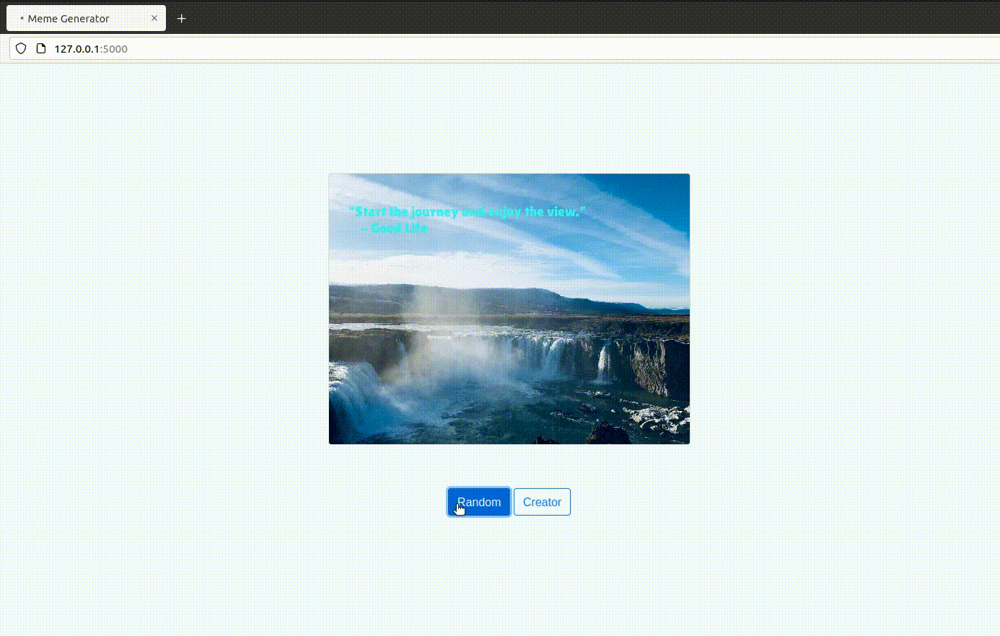

# Meme-Generator
The meme generator lets you create memes with established quotes and images; moreover, you can customize your own beautiful memes and share them with your friends or loved ones!

## Overview
The meme generator is a multimedia application to dynamically generate memes, including an image with an overlaid quote. This packaged applications can be accessed in 2 ways. Command-line or web service. Not only we can generate random memes by command-line utility, but also we can interact with web interface, where you can generate random memes at the click of a button, or make your app accept user input through a post request.

Below is a created meme demo inspired by one of my favorite movie, La La Land.

## Block Diagram
This [overengineering](https://en.wikipedia.org/wiki/Overengineering) solution consists of 4 main modules – Quote Engine, Meme Engine, Plot Engine, and AI Engine.

 - **Quote Engine**: The `Quote Engine` module is responsible for ingesting many types of files that contain quotes. For the sake of image maker with text purposes, a *quote* contains a *body* and an *author*.

### QuoteEngine
