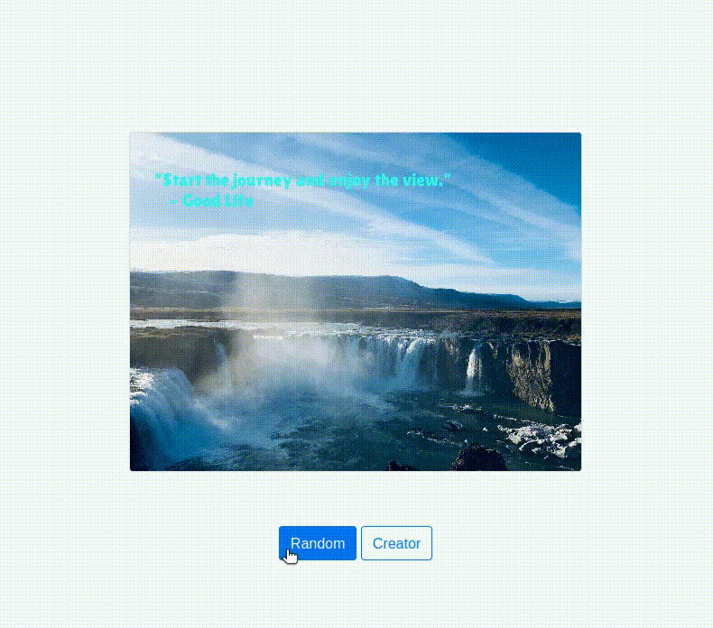
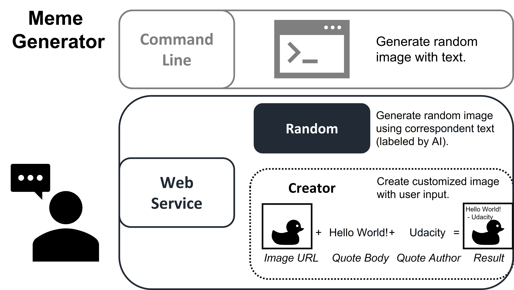
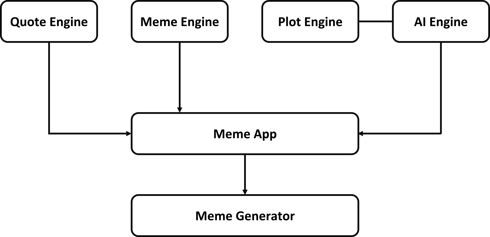
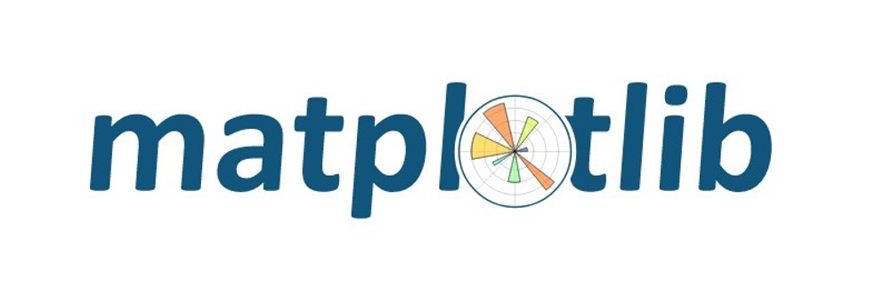
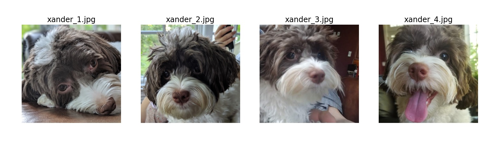
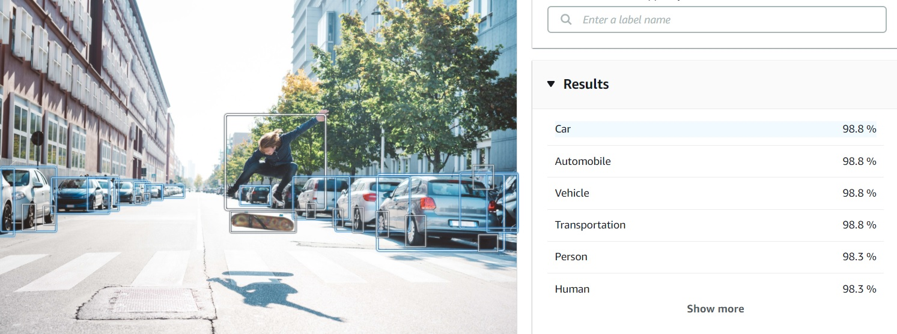

# Meme-Generator

[](https://travis-ci.org/python/pythondotorg)
[](https://pythondotorg.readthedocs.io/?badge=latest)
[](LICENSE)

The meme generator lets you create memes with established quotes and images; moreover, you can customize your own beautiful memes and share them with your friends or loved ones!



## Overview
The meme generator is a multimedia application to dynamically generate memes, including an image with an overlaid quote. 

This packaged applications can be accessed in 2 ways: 
 - Command-Line
 - Web Service

Not only we can generate random memes by command-line utility, but also we can interact with web interface, where you can generate random memes at the click of a button, or make your app accept user input through a post request.



Below is a created meme demo inspired by one of my favorite movie, La La Land.


## Block Diagram
This [overengineering](https://en.wikipedia.org/wiki/Overengineering) solution consists of 4 main modules – Quote Engine, Meme Engine, Plot Engine, and AI Engine.



 - **Quote Engine**: The `Quote Engine` module is responsible for ingesting many types of files that contain quotes. For the sake of image maker with text, a *quote* contains a *body* and an *author*.

 - **Meme Engine**: The `Meme Engine` is responsible for manipulating and drawing text onto images. The object-oriented thinking is applied to demonstrate knowledge of using more advanced third party library for image manipulation.

 - **Plot Engine**: The `Plot Engine` module is responsible for data visualization for all the images contained in this program.

 - **AI Engine**: The `AI Engine` is responsible for object detection. It leverage [Amazon Rekognition](https://aws.amazon.com/rekognition/?nc1=h_ls&blog-cards.sort-by=item.additionalFields.createdDate&blog-cards.sort-order=desc) to identify the image content and define rules to choose the quote category.

 - **Meme App**:
 - **Meme Generator**:

## QuoteEngine
This module will be composed of many classes. The complex inheritance, abstract classes, classmethods, strategy objects and other fundamental programming principles of Python are used to complete this module.

### Structure of Quote Engine
```
.
├── CSVImporter.py
├── DocxImporter.py
├── IngestorInterface.py
├── Ingestor.py
├── __init__.py
├── PDFImporter.py
├── QuoteModel.py
└── TXTImporter.py

0 directories, 8 files
```

- `__init__.py`: To make Python treat directories containing it as modules. Furthermore, this is the first file to be loaded in a module, so you can use it to execute code that you want to run each time a module is loaded, or specify the submodules to be exported.
- `QuoteModel.py`: Blueprint for quote.
- `IngestorInterface.py`: The ingestor interface backbone. It is a abstract base class works as a parent class for DocxImporter.py, CSVImporter.py, TXTImporter.py, PDFImporter.py, and Ingestor.py.
- `DocxImporter.py`: Child class of `IngestorInterface` to ingest 'docx' file extension.
- `CSVImporter.py`: Child class of `IngestorInterface` to ingest 'csv' file extension.
- `TXTImporter.py`: Child class of `IngestorInterface` to ingest 'txt' file extension.
- `PDFImporter.py`: Child class of `IngestorInterface` to ingest 'pdf' file extension.
- `Ingestor.py`: Child class of `IngestorInterface` to implement logic to select the appropriate helper for a given file based on filetype.

## Meme Engine
The meme engine module is used for image manipulation. The purpose is to generate image with resized width and height, and then put the quotes onto it.

### Structure of Meme Engine
```
.
├── fonts
│   ├── LilitaOne-Regular-1.ttf
│   └── LilitaOne-Regular-2.ttf
├── __init__.py
└── MemeGenerator.py

1 directory, 4 files
```

 - `__init__.py`: Special file that declares that a directory is a Python module. .
 - `MemeGenerator.py`: Define MemeGenerator class to manipulate image.
 - `fonts`: A directory contains 2 font templates.

## Plot Engine
Plot Engine is an individually special module. We can perform data visualization by using [matplotlib](https://matplotlib.org/) to view all images included in this application. It will help us to have an overall picture of the photos used to generate random meme. In addition, we can check each image path based on [Amazon S3 (Simple Storage Service)](https://aws.amazon.com/s3/) printed on plotted figure as well.



### Structure of Plot Engine
```
.
├── __init__.py
└── PlotEngine.py

0 directories, 2 files
```
 - `__init__.py`: To let the Python interpreter know that a directory contains code for a Python module.
 - `PlotEngine.py`: Define PlotEngine class to conduct data visualization.

The following is a sample of using Plot Engine to execute data visualization for all dog photos.



## AI Engine
The core concept of AI Engine is to carry out image inference and detect labels. We define rules and use label extracted to let the computer automatically class the image with correspondent quotes. Basically, we utilize Amazon Rekognition for this task.


What is Amazon Rekognition?
 - Amazon Rekognition is a service that makes it easy to add powerful visual analysis to our applications. 
 - It is based on the highly scalable, deep learning technology developed by Amazon’s computer vision scientists to analyze billions of images and videos daily.
 - That way, it requires no machine learning expertise to use. We don’t need to handle complex AI infrastructure or deal with time-consuming model training.

In this case,



### Structure of AI Engine
```
.
├── AIEngine.py
└── __init__.py

0 directories, 2 files
```
 - `__init__.py`: To define what gets brought into the namespace with the import statement.
 - `AIEngine.py`: Define AI Engine class to utilize AWS Rekognition to detect labels in the photo.

## Set up

 - OS: Linux distribution - [Ubuntu 20.04.3 LTS](https://ubuntu.com/download/desktop). We can check the [release notes](https://wiki.ubuntu.com/FocalFossa/ReleaseNotes?_ga=2.218895194.2117983555.1631591363-727216992.1631591363) to see an overview of the release and documentation of the known issues in detail.
 - Python version: [3.8.10](https://www.python.org/downloads/release/python-3810/)

**Prerequisites**: To install Python virtual environment establishment, package management system (pip), and some useful libraries.
```
sudo apt install -y python3.8-venv python3-pip python3-tk curl vim git
```

### Build

First, clone this repository to create a local copy on your computer.
```
git clone https://github.com/jonathanyeh0723/meme-generator
```

Next

### Test

### Deploy

## Pipeline


## Resources

